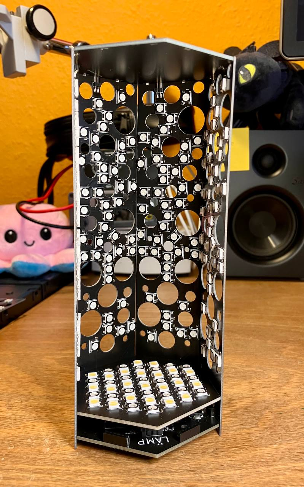
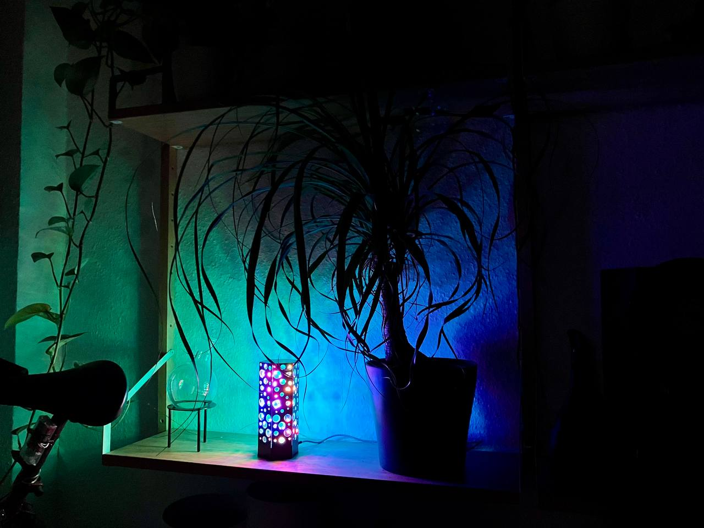
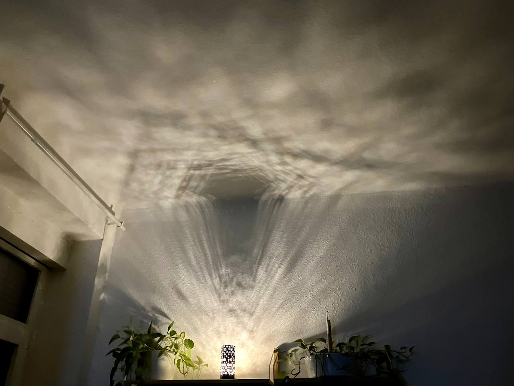
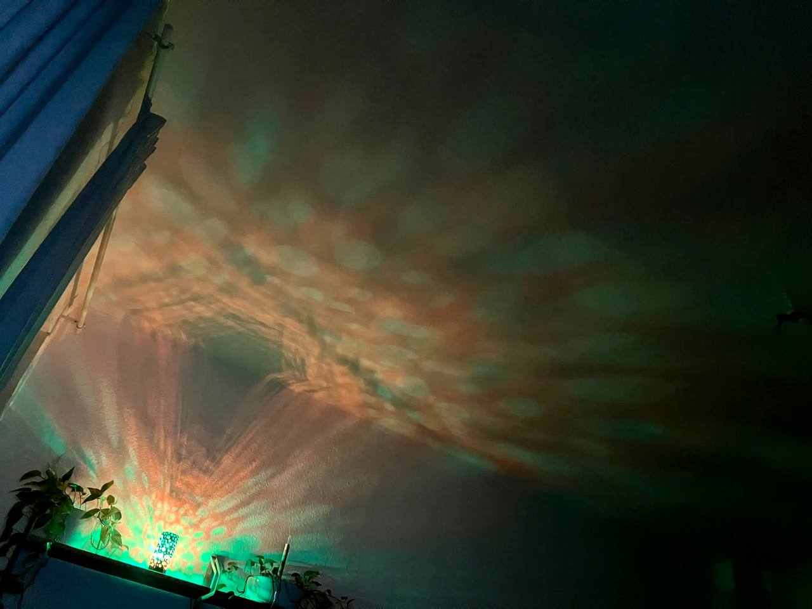
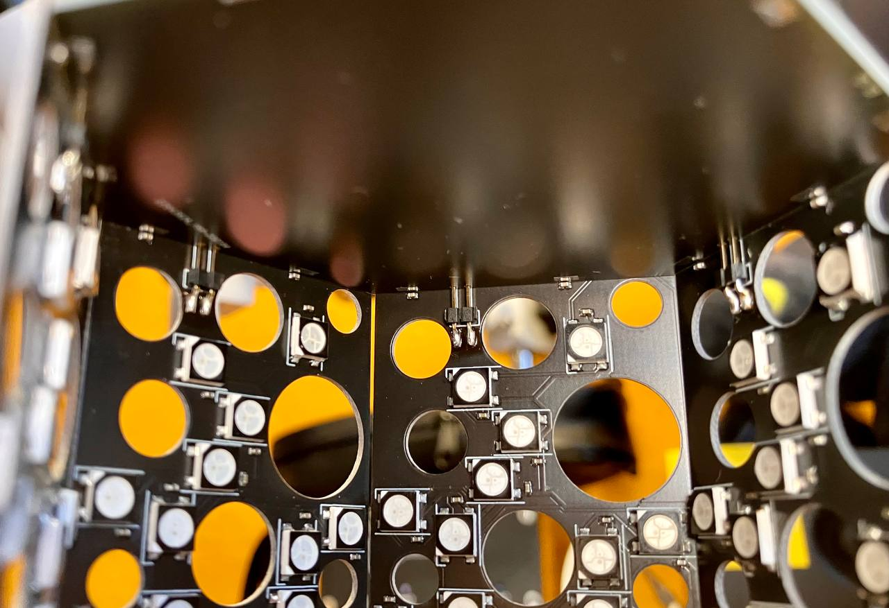
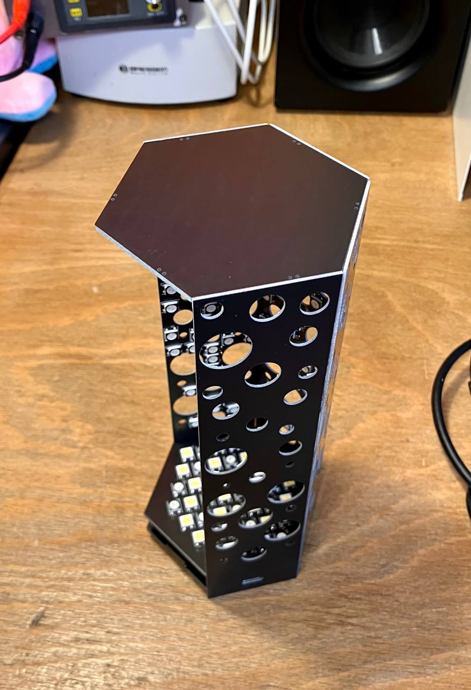
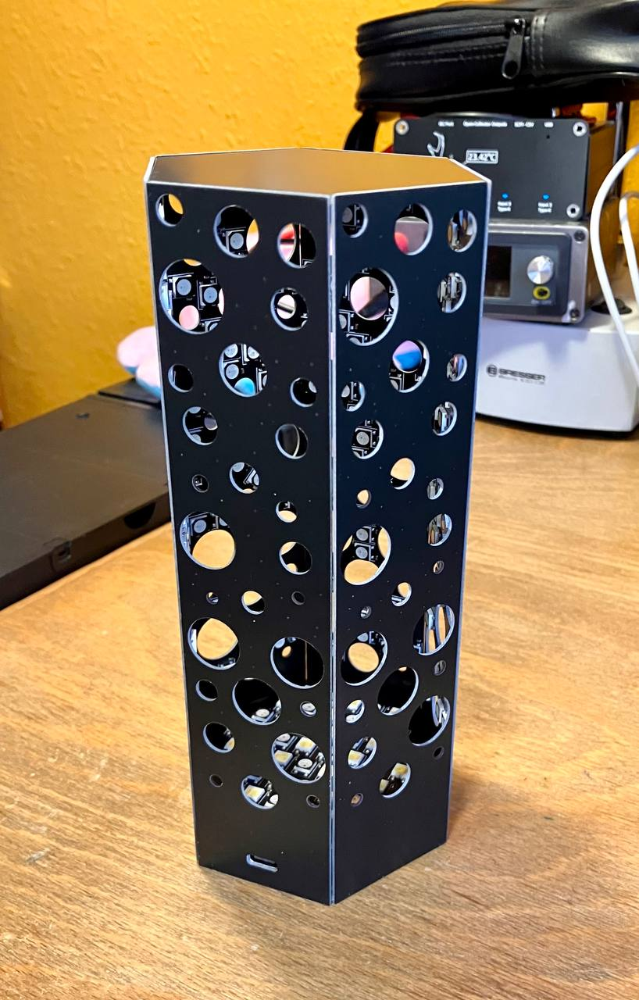

# LAEMP-Prism

The LÄMP-Prism is an aesthetically pleasing and colorful effect lamp that can be used in your home. It can be controlled using Zigbee (e.g., Philips Hue) and has RGBY + WW/CW LEDs, providing a wide dynamic range and fantastic color representation. The lamp can be soldered together at home or assembled by JLCPCB.

The project consists of nine PCBs that are cleverly interlocked with pinheaders and capacitors. The Prism-like shape, combined with its 291 LEDs, projects a slightly changing dotted pattern into its environment.

<table>
  <tbody>
    <tr>
      <td>
        
      </td>
      <td>
        
      </td>
    </tr>
  </tbody>
</table>

This project is an attempt to add some colored lights and interesting patterns to ones home. I hope you enjoy it! :3

<table>
  <tbody>
    <tr>
      <td>
        
      </td>
      <td>
        
      </td>
    </tr>
  </tbody>
</table>

### V2

Please note that the E75-2G4M20S module is End of Life and is hard to obtain. I'm working on a V2.0 with STM32WB (see [MiniBee](https://github.com/Jana-Marie/MiniBee)). Hence the Hex-Base-Board is subject to be updated, all other boards shouldnt change.

### Sister project

LAEMP-Prism is a sister project to (LAEMP-Panel)[https://github.com/Jana-Marie/LAEMP-Panel]

## Concept

The overall concept was developed in OpenSCAD and a pseudo-random pattern of circles was choosen for the walls. If one wants to put effort into this project, different walls can be used. The standard base-to-wall-interface also allows for much different and custom walls. E.g. hexagonal holes, shorter or taller walls, bended walls, ...

## Build

This build is definitely time-consuming, as each LAEMP Prism features 291 LEDs, and therefore requires at least 291 100nF capacitors. Additionally, the wall PCBs are rather thin and long, making reflow difficult and assembly time-consuming.

Once all eight boards are assembled (the top board has no components ^⁻^), they can be interlocked with one another. To do this, begin by plugging the LED-Base-Board into the Base-Board, and then carefully plugging wall after wall into the baseboard. Try to put the Top-Board onto the build after assembling five boards. The board with the Type-C cutout should not be the last board to assemble. Finally, try to plug in the last board. This step can be quite tricky and may require a few attempts. Once all boards are assembled, align all walls with each other and place the whole board onto the 3D printed base.

You will need the following set of baords for a build:

 - 1 x Base-Board
 - 1 x Base-LED-Board
 - 1 x Top-Board
 - 5 x Wall-Board
 - 1 x USB-Wall-Board

<table>
  <tbody>
    <tr>
      <td>
        
      </td>
      <td>
        
      </td>
    </tr>
    <tr>
      <td>
        
      </td>
      <td>
        
      </td>
    </tr>
  </tbody>
</table>

## Firmware

There are two firmwares to be flashed, one for the ESP32 and one for the E75-2G4M20S.

### ESP32

This is a simple Arduino project and can be flashed via Arduino (initially built on Arduino 1.8.19).

### E75

Please refer to the awesome works of [PeeVeeOne](https://peeveeone.com/zll-tldr/) to flash `Light_ColorLight_JN5168_RGB` onto the E75-2G4M20S module.

## Folder Structure

 - 3D/				3D-Printable base, Concept
 - design/			assets, renders
 - images/			images for README
 - laemp_base/ 		base board hosting the MCU(s)
 - laemp_led_board/ LED base board, plugs directly ontop of the base board
 - laemp_top/ 		top board, has no electrical functionality, just mechanical
 - laemp_wall/ 		wall board, hosting 41 leds each
 - laemp_wall_usb/ 	same wall board, but with USB cutout
 - firmware/
   - leamp_prism/	ESP32 FW
   - zigbee/		E75 FW

## License

[CERN Open Hardware Licence Version 2 - Strongly Reciprocal](/LICENSE)